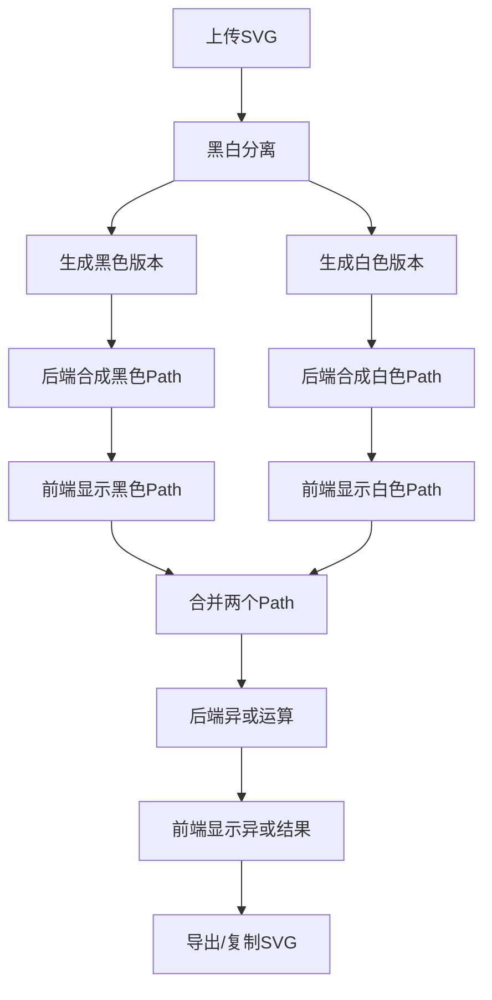

#  SVG彩色转黑白异或工具——完整流程

---

## 1. 上传SVG

- **用户操作**：点击“选择SVG文件”或选择示例SVG。
- **前端行为**：读取SVG文件内容，显示在“原始彩色SVG”预览框。

---

## 2. 黑白分离（阈值转换）

- **用户操作**：可调整“黑白转换阈值”滑块，或点击“自动阈值(OTSU)”按钮自动计算最佳阈值。
- **前端行为**：
  - 解析SVG所有元素的颜色（fill、stroke等）。
  - 按阈值将每个像素/元素分为“黑色”或“白色”：
    - 灰度值 ≤ 阈值 → 黑色
    - 灰度值 > 阈值 → 白色
  - 生成两个SVG版本：
    - **黑色版本**：只有黑色部分可见
    - **白色版本**：只有白色部分可见

---

## 3. Path合成（单一path化）

- **前端行为**：
  - 分别将黑色版本和白色版本SVG，**通过API发送到后端**，请求“合成单一path”。
  - **后端行为**（Node.js）：
    - 用`svg-flatten`、`flatten-svg`等库将SVG所有形状合并为一个path（多边形集合）。
    - 用Clipper库做布尔合并，输出单一path。
    - 按前端传递的`fillColor`参数，生成黑色或白色的SVG path。
  - **前端行为**：
    - 接收后端返回的SVG，分别显示在“黑色Path”和“白色Path”预览框。

---

## 4. Path异或运算

- **前端行为**：
  - 将“黑色Path”和“白色Path”两个SVG的path元素合并到一个SVG中，作为新的输入。
  - 发送到后端API，请求“异或运算”。
  - **后端行为**：
    - 解析两个path，使用Clipper库做“异或”布尔运算（XOR），得到重叠部分去除、非重叠部分保留的新path。
    - 用`fillColor='#000000'`生成最终SVG。
  - **前端行为**：
    - 接收后端返回的异或结果SVG，显示在“Path异或结果”预览框。

---

## 5. 导出与复制

- **用户操作**：可点击“下载黑色Path”、“下载白色Path”、“下载异或结果”或“复制异或代码”按钮。
- **前端行为**：直接下载或复制后端返回的SVG代码，保证颜色和结构与预览一致。

---

#  交互流程图

---

#  典型操作流程举例

1. 上传或选择一个彩色SVG。
2. 调整阈值，观察黑白分离效果。
3. 工具自动将黑白两部分分别合成单一path。
4. 工具自动对两个path做异或，显示最终结果。
5. 可随时导出或复制任意阶段的SVG代码。

---
